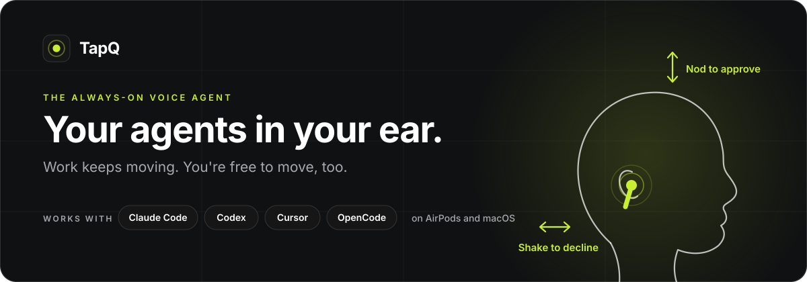
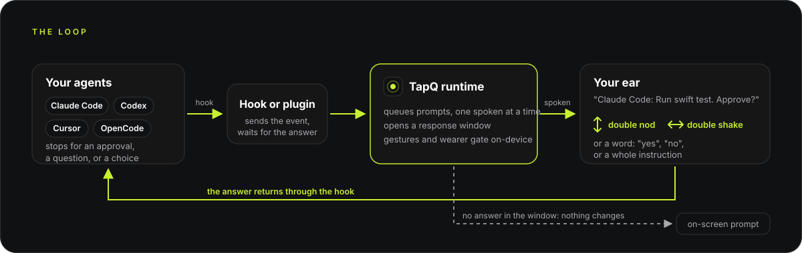
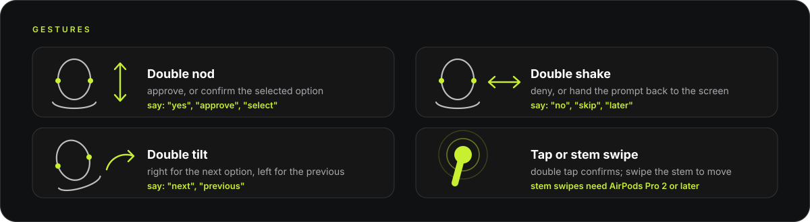

<p align="center">
  <a href="https://tapq.ai"></a>
</p>

<p align="center">
  <a href="https://github.com/spaceamoeba-t/tapq/actions/workflows/ci.yml"></a>
  <a href="https://github.com/spaceamoeba-t/tapq/tags"></a>
  
  
  
  <a href="LICENSE"></a>
</p>

<p align="center">
  <a href="https://tapq.ai">Website</a> ·
  <a href="#quick-start">Quick start</a> ·
  <a href="docs/CLI.md">CLI reference</a> ·
  <a href="docs/ROADMAP.md">Roadmap</a> ·
  <a href="CONTRIBUTING.md">Contributing</a>
</p>

AI scales. Your attention doesn't. Agents work in parallel, and keeping them moving
still pulls you back to a screen — to check, to answer, to approve.
**Checking fragments your focus:** which agent finished, which one is stuck.
**Every switch costs context:** open the tool, read the thread, find what needs you.
**Stepping away stops the work:** a question or an approval sits unanswered until you
return. You've delegated the work; staying in control still ties you to a screen.

Agents are the first software you don't operate but supervise, and supervision doesn't
need a screen — it needs a way to reach you. TapQ is that way. Works today with Claude
Code, Codex, Cursor, and OpenCode, on AirPods and macOS.

## Contents

- [What it does](#what-it-does)
- [How it works](#how-it-works)
- [Privacy and data](#privacy-and-data)
- [Where TapQ fits](#where-tapq-fits)
- [Current support](#current-support)
- [Controls](#controls)
- [Quick start](#quick-start)
- [FAQ](#faq)
- [Developer guide](#developer-guide)
- [Documentation](#documentation)
- [Community](#community)
- [License](#license)

## What it does

TapQ is a voice agent that runs in the background all day, connected to your coding
agents through their hooks. It listens on-device, speaks only when an agent needs you or
you speak to it, and hears your answer through the earbuds. Four things:

- **Speaks every prompt.** When Claude Code, Codex, Cursor, or OpenCode stops for an
  approval, a question, or a choice, TapQ says it in your ear: `Claude Code: Run swift
  test. Approve?` You answer "yes", double-nod, or tilt and tap through the options.
  Prompts from every open session arrive as one spoken queue.
- **Reports a finished run and takes the next instruction.** "Claude Code finished the
  migration." — "Tell it to rerun the tests." — "Queued for Claude Code." An agent's
  turn ends in your ear, and the next one starts there.
- **Answers questions about the work.** "Who's waiting?" "What did Codex change?" TapQ
  reads the agents' own transcripts and answers in a sentence instead of a tab.
- **Takes goals and follow-ups.** "Run the tests and tell me if anything fails." "When
  Claude Code finishes, rerun the tests." With nothing running at all, "Hey TapQ, set up
  a Swift package for the parser" starts a session.

An afternoon with two agents:

```
Claude Code: Run swift test. Approve?
  "yes"
Codex: Run python migrate.py. Approve?
  "no, tell Codex to keep the old table names"
  Queued for Codex.
  "who's waiting?"
  Nothing is waiting. Claude Code finished the migration.
  "when Claude Code finishes the changelog, rerun the tests"
  After Claude Code finishes: rerun the tests — noted.
```

Answering needs no wake word, nothing to open, nothing to look at. Anything TapQ cannot
answer — a multi-select prompt, a missed gesture, a failed voice pipe — falls back to
the agent's on-screen prompt exactly as if TapQ weren't installed. Everything TapQ does
unprompted is spoken and attributed, and none of it can approve anything.

## How it works

<p align="center">
  
</p>

TapQ is a runtime on your Mac with an adapter for each agent and each device.

1. **Hooks in the agents.** `tapq integration <agent> install` adds a hook (Claude Code,
   Codex, Cursor) or a plugin (OpenCode) to the agent. When the agent stops for a
   permission, a question, or a choice, or finishes a turn, the hook sends that event to
   the runtime and waits for the answer.
2. **Spoken in-ear, then a response window.** The runtime speaks the prompt through the
   earbuds and listens for a set time. Prompts from several sessions queue and are spoken
   one at a time, each named with its agent.
3. **Gestures from the motion stream.** AirPods report head motion; TapQ recognizes a
   double nod, double shake, double tilt, and stem tap on-device and maps them to
   approve, deny, next or previous option, and confirm.
4. **Speech through a voice backend.** With `--voice-backend openai-realtime`, your
   speech is sent to OpenAI's realtime API only while a window is open, and the model
   turns what you said into one of a fixed set of actions: approve, deny, select an
   option, queue an instruction for an agent, answer a question about status or an
   agent's transcript, set a follow-up, or start a task. It can speak only what TapQ
   passes it; it cannot answer a prompt on its own. The default on-device backend
   matches a fixed vocabulary instead.
5. **Wearer attribution.** The same motion sensors register the vibration of your own
   speech. With `--wearer-gate`, speech that does not coincide with it is ignored, so a
   colleague or a video cannot answer for you.
6. **Back through the hook, or back to the screen.** The answer returns to the agent
   through its hook. If the window times out or nothing is recognized, the hook returns
   without an answer and the agent shows its normal on-screen prompt.
7. **Between prompts.** With `--attention wake`, an on-device recognizer listens for
   "hey tapq" whenever nothing else is listening and opens a window with the same rules;
   with no session running, a sentence starts one. What you and TapQ say to each other
   is appended to a local file, and a recent slice of it is given to the model each turn
   so it can resolve "the thing I asked about earlier".

## Privacy and data

TapQ sits between you and tools that can run commands, so the boundaries are part of
the design, not a settings page. What ships today:

- **Head motion is read only inside a window.** The motion stream opens when TapQ
  speaks a prompt or hears the wake word and stops when the window resolves. Between
  windows, a nod at a colleague does nothing in TapQ.
- **Gesture recognition and wearer attribution run on-device.** Nothing leaves the Mac
  to decide whether you nodded or whether the voice was yours.
- **Speech leaves the Mac only if you opt in, and only inside a window.** The default
  backend matches a fixed vocabulary on-device with no API key. With
  `--voice-backend openai-realtime`, audio goes to OpenAI's realtime API only while a
  response window is open; wake-word listening between windows stays on-device.
- **Conversation memory is local, bounded, and yours to clear.** With the realtime
  backend, what you and TapQ said to each other is appended to
  `wearer-conversation.jsonl` in the runtime directory. It keeps 30 days or a couple of
  megabytes, whichever comes first, and `tapq memory clear` wipes it. Tool inputs,
  working directories, and permission modes are never spoken and never recorded.
- **Nothing TapQ does on its own can approve anything.** Follow-ups, goals, and the
  deliberation loop can queue an instruction or say a sentence; every approval still
  comes from your gesture or your voice. The risk reasoner is escalation-only: it can
  raise the confirmation bar for a prompt and can do nothing else.
- **Failure falls back to the screen.** A timed-out window, a missed gesture, or a dead
  voice pipe returns the prompt to the agent's own on-screen flow.

The [local broker boundary](SECURITY.md#local-broker-boundary) describes what the hooks
and the runtime can and cannot do to each other. [Privacy principles](docs/product/PRIVACY.md)
sets the rules for planned capture modes (explicit start, clear state, consent first)
that shipped functionality will be held to.

## Where TapQ fits

Nodding to answer an earbud is no longer exotic. Siri Interactions on AirPods let you
nod yes or shake no to Siri, and every coding agent now offers some way to approve a
prompt from a phone. TapQ is for the gap between them:

| | Siri Interactions on AirPods | Approve from the agent's phone app | TapQ |
|---|---|---|---|
| What a nod answers | Siri's own prompts | Nothing; you tap on a screen | Claude Code, Codex, Cursor, and OpenCode prompts |
| Where the prompt reaches you | Siri | A notification you read | Spoken in your ear, named with its agent |
| Beyond yes and no | Siri's features | The agent's own UI | Options, instructions, questions about the work, goals, follow-ups |
| Model | Apple's | The agent's | Your choice of realtime backend, or on-device with no key |
| Source | Closed | Closed | Apache 2.0, one Swift package, adapters you can add to |

TapQ is not an assistant and does not want to be one. It is the interaction layer
between the assistants you already run and the earbuds you already wear.

## Current support

| | Supported today |
|---|---|
| **Version** | `0.5.0-beta.2`, pre-1.0, source-only (no Homebrew formula or signed download yet) |
| **Mac** | macOS 14 or newer, Swift 6, Xcode 16 or a compatible toolchain |
| **Earbuds** | Any AirPods that expose head motion: AirPods Pro (all generations), AirPods 3 and later, AirPods Max. Stem swipes need AirPods Pro 2 or later. Tested on AirPods Pro |
| **Claude Code** | Hook support: approvals, denials, option selection, notifications, and questions in final responses |
| **Codex CLI** | `0.142.5` or newer: structured single-choice questions, native permission approvals, completion, and final-response questions, with fail-through |
| **Cursor** | Agent hooks: shell and file-tool approvals and completion announcements; questions stay on screen until Cursor exposes them |
| **OpenCode** | `1.18.15` or newer, through a TapQ-managed plugin: permission prompts and completion, with fail-through |
| **Linux** | The portable core and management CLI build and test on Linux; no earbuds or agents |
| **CI** | Every pull request and push to `main` builds and tests the full graph on macOS 15 and the portable core on Linux |

Exactly which prompt types each agent exposes, and what is waiting on the agent
vendors, is tracked line by line in the [roadmap](docs/ROADMAP.md). Apple Watch is the
next device.

## Controls

<p align="center">
  
</p>

| Intent | Motion or hardware | Voice examples |
|---|---|---|
| Approve / yes | Double nod or double tap | `yes`, `approve`, `go ahead` |
| Deny / no | Double shake | `no`, `deny`, `cancel` |
| Next option | Stem swipe down (volume down) or double tilt right | `next`, `move on` |
| Previous option | Stem swipe up (volume up) or double tilt left | `previous`, `go back` |
| Confirm option | Double nod or double tap | `select`, `this one`, `one`–`four` |
| Return to on-screen prompt | Double shake | `skip`, `later`, `not sure` |

A tilt is a lateral ear-toward-shoulder lean; two quick tilts to the same side
navigate, so a single lean never moves the selection. With the realtime voice backend,
anything beyond these words — an instruction, a question, a goal — is understood as a
sentence; the on-device backend matches the English (`en-US`) grammar above.

TapQ handles one single-select question at a time. Anything it can't answer —
multi-select prompts, multiple questions, a missed gesture — stays in the agent's
normal on-screen flow.

## Quick start

TapQ is source-only for now — no Homebrew formula or signed download yet. You need
Swift 6, macOS 14 or newer with Xcode 16 (or a compatible toolchain), an AirPods
model with headphone motion (AirPods Pro, AirPods 3 or later, or AirPods Max —
tested on AirPods Pro), and Claude Code with hook support, a local Codex CLI
(`0.142.5` or newer), Cursor, or OpenCode (`1.18.15` or newer). Keep the AirPods
connected, in-ear, and selected as the audio output.

Without AirPods, `tapq serve` still runs. TapQ says so once and degrades to a plain
voice agent on whatever the system's default input and output are — prompts spoken on
the Mac's speaker, answered by voice — with gestures, taps, tilts, and volume swipes
inert. Connect AirPods mid-session and the next prompt has them back.

```bash
git clone https://github.com/spaceamoeba-t/tapq.git
cd tapq
swift build && swift test
```

**1. Calibrate** — builds and launches the locally signed headless app container so
macOS can grant Motion, Speech, and Microphone permissions to a stable identity:

```bash
scripts/run-runtime-app.sh calibration run
```

**2. Connect an agent:**

```bash
# Claude Code (native policy recommended for interactive use):
build/TapQRuntime.app/Contents/MacOS/tapq integration claude install --permission-policy native

# Codex — then open Codex, run /hooks, and trust the TapQ hooks:
build/TapQRuntime.app/Contents/MacOS/tapq integration codex install

# Cursor — restart Cursor if an already-open session does not pick the hooks up:
build/TapQRuntime.app/Contents/MacOS/tapq integration cursor install

# OpenCode — then restart OpenCode so it loads the TapQ plugin:
build/TapQRuntime.app/Contents/MacOS/tapq integration opencode install
```

**3. Start TapQ** and keep it running while you use the agent. The conversational
features — instructions, questions about the work, goals, follow-ups — run on the
realtime voice backend and need `OPENAI_API_KEY` in the launcher's environment:

```bash
scripts/run-runtime-app.sh serve --voice-backend openai-realtime \
  --voice-instructions --voice-session --wearer-gate --attention wake
```

`--wearer-gate` is the attribution gate: an instruction is accepted only from a voice the
earbuds felt. `--voice-trust environment` replaces it when you trust the room, for
example on a Mac without AirPods. `scripts/run-runtime-app.sh serve` with no flags runs
the reactive loop alone — prompts spoken, answered by gesture or a fixed vocabulary —
with on-device speech and no API key.

That's the whole loop: the next time the agent stops to ask, you'll hear it.

For permission-policy details, the exact Codex hook and OpenCode plugin contracts,
question classifiers, the risk reasoner, and packaging, see the
[integration guide](docs/INTEGRATIONS.md); for every command and flag, see the
[CLI reference](docs/CLI.md).

## FAQ

**Do I need AirPods?**
No. Without them TapQ runs as a plain voice agent on the Mac's default input and
output. Gestures, taps, tilts, and stem swipes are inert until AirPods connect, and the
next prompt after they do has them back.

**Do I need an OpenAI API key?**
Only for the conversational features: instructions, questions about the work, goals,
and follow-ups run on the realtime backend. The reactive loop (prompts spoken, answered
by gesture or a fixed vocabulary) runs on-device with no key.

**What happens if TapQ misses a gesture or I don't answer?**
The window times out, the hook returns without an answer, and the agent shows its
normal on-screen prompt. TapQ never guesses.

**Can TapQ approve something without me?**
No. Follow-ups, goals, and questions about the work can queue an instruction or speak a
sentence, and every one of them is announced and attributed. Approval comes only from
your gesture or your voice, and the risk reasoner can only raise the bar, never lower it.

**Someone else in the room said "yes." Does that count?**
Not with `--wearer-gate`. The earbuds register the vibration of your own speech, and
speech that does not coincide with it is ignored.

**Does it record audio?**
The default backend matches speech on-device. With the realtime backend, audio is sent
to OpenAI only while a response window is open, and what was said (the words, not the
audio) is kept in a local file for 30 days that `tapq memory clear` wipes.

**Can I use the gesture engine without the agent machinery?**
Yes. `TapQDetectionBaseline` has no agent dependency and can be depended on from your
own Swift project today; a standalone package is planned. `tapq capture` and `tapq
replay` let you record a motion trace and score a detector against it offline.

**Which agent gets the most complete support?**
Claude Code, because its hooks expose the most. Codex, Cursor, and OpenCode each have a
supported slice bounded by what their hook or plugin surface carries; the
[roadmap](docs/ROADMAP.md) lists what is waiting on each vendor.

## Developer guide

The repository is one Swift package. Its main targets follow the data path above:

- `TapQContracts` — the shared types and protocols: requests, answers, agent and
  device descriptions.
- `TapQDetectionBaseline`, `TapQInteractionBaseline`, `TapQContextBaseline` — the
  portable core: gesture recognition and calibration, the response-window state machine
  and voice intent tools, question classification and memory. No Apple dependency;
  this is what builds and tests on Linux.
- `TapQBrokerRuntime`, `TapQWireProtocol` — the local broker and the socket protocol
  the hooks speak.
- `TapQClaudeAdapter`, `TapQCodexAdapter`, `TapQCursorAdapter`, `TapQOpenCodeAdapter`
  — one target per agent, translating its hook or plugin events. A new agent is a new
  target of this shape; the [integration guide](docs/INTEGRATIONS.md) documents the
  contracts.
- `TapQAppleAdapters`, `TapQVoiceBackends` — CoreMotion, Speech, and audio on macOS,
  and the realtime voice backend.
- `TapQCLI` and `Executables/` — the command grammar, then `tapq` and the per-agent
  hook binaries that compose the above with concrete platform services.

Build and test with `swift build && swift test`, then `scripts/check-public-boundary.sh`
before opening a pull request. Gesture recognition can be developed without AirPods
in hand: `tapq capture` records a motion trace and `tapq replay` scores a detector
against it offline (see the [CLI reference](docs/CLI.md)). The gesture engine has no
agent machinery attached, so it can be depended on from your own Swift project as
`TapQDetectionBaseline` today; a standalone package is planned. Conventions, target
ownership, and the contribution license are in [CONTRIBUTING.md](CONTRIBUTING.md).

## Documentation

Using and extending TapQ:

- [CLI reference](docs/CLI.md) — every command and flag, including `tapq capture` and `tapq replay` for recording motion and scoring gesture accuracy offline
- [Integration guide](docs/INTEGRATIONS.md) — permission policies, the Codex hook and OpenCode plugin contracts, question classifiers, the risk reasoner, and packaging
- [Roadmap](docs/ROADMAP.md) — agent integrations, wearables, and interaction capabilities, with what is built and what is next
- [Troubleshooting](TROUBLESHOOTING.md)
- [Changelog](CHANGELOG.md)

Where it is going:

- [Product vision](docs/product/OVERVIEW.md) — how the same interaction model extends from agent control to meetings, learning, and travel
- [Use cases](docs/product/USE_CASES.md), [Business Mode](docs/product/BUSINESS_MODE.md), [Lecture Mode](docs/product/LECTURE_MODE.md), [Travel Mode](docs/product/TRAVEL_MODE.md)
- [Privacy principles](docs/product/PRIVACY.md) — the rules planned capture modes are held to
- [Experience roadmap](docs/product/ROADMAP.md)

Project:

- [Contributing](CONTRIBUTING.md) — includes the build/test/boundary checks to run before submitting a change
- [Release process](RELEASING.md) — signed source tags, qualification gates, and source-only GitHub publication
- [Security policy](SECURITY.md) — how to report a vulnerability, supported versions, and the local broker boundary
- [Code of conduct](CODE_OF_CONDUCT.md)
- [Trademarks](TRADEMARKS.md)

## Community

- **Found a bug or want an agent or device supported?** Open an
  [issue](https://github.com/spaceamoeba-t/tapq/issues); the templates ask for the
  version, agent, and earbuds so a report can be reproduced.
- **Found a vulnerability?** Report it privately, as described in the
  [security policy](SECURITY.md). Please do not open a public issue for it.
- **Want to add an agent or a device?** Each is one adapter target; start with the
  [integration guide](docs/INTEGRATIONS.md) and [CONTRIBUTING.md](CONTRIBUTING.md).
- **Website:** [tapq.ai](https://tapq.ai)

## License

TapQ source code and documentation are licensed under the
[Apache License 2.0](LICENSE); see [NOTICE](NOTICE) for attribution. The license does
not grant rights to the TapQ name or marks, and the artwork in `assets/brand/` is
separately reserved; see [TRADEMARKS.md](TRADEMARKS.md).

---

Terminal → Mouse → Touchscreen → TapQ. The screen was where computers made us come to
them. Agents don't need that. TapQ is how they come to you.
